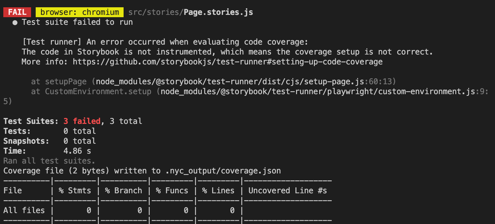
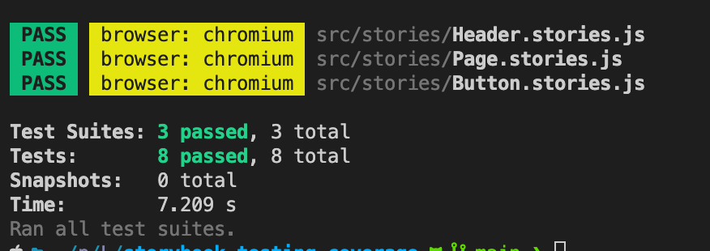

# Storybook coverage repo

## Dependencies
- Vue 3
- Vite

# Setup


```
npm install
```

## compiles and hot-reloads for development
```
npm run dev
```

## setup for storybook
```
npm run storybook
```


## run coverage
```
npm run test-storybook -- --coverage
```
# How it was before
- coverage was populated correctly 
with this environment
```
"@storybook/addon-coverage": "^0.0.2",
"@storybook/addon-interactions": "^6.5.9",
"@storybook/builder-vite": "^0.2.2",
"@storybook/jest": "^0.0.10",
"@storybook/test-runner": "^0.5.0",
"@storybook/vue3": "^6.5.9",
"jest": "^27.5.1",
```

# what I changed
- upgrade @storybook/test-runner to 0.6.1
```
"@storybook/test-runner": "^0.6.1",

```


# what I am getting
- when I run test with coverage, test fails. When I run only test it works
```
npm run test-storybook -- --coverage
```

```
npm run test-storybook 
```




