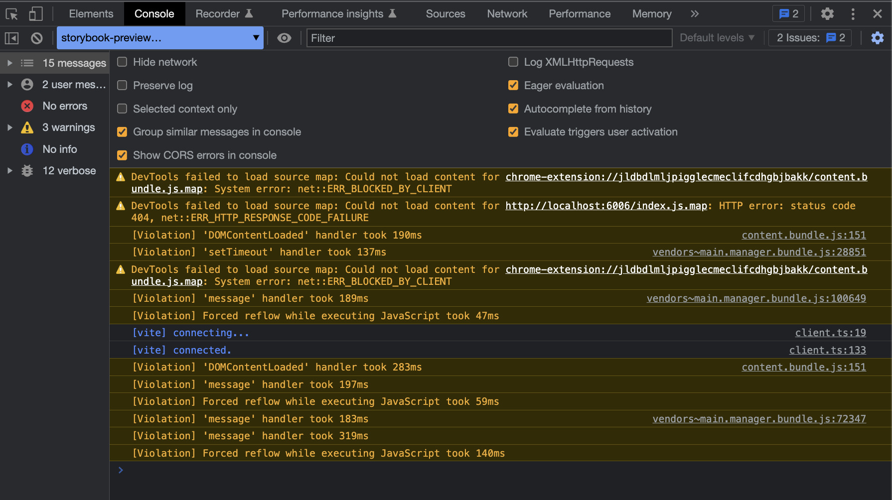

# Storybook coverage repo

## Dependencies
- Vue 3
- Vite

# Setup


```
npm install
```

## compiles and hot-reloads for development
```
npm run dev
```

## setup for storybook
```
npm run storybook
```


## run coverage
```
npm run test-storybook -- --coverage
```


# what I did
1. installed `@storybook/addon-coverage` add on and register it in .storybook/main.js
2. installed `vite-plugin-istanbul` and register it in .storybook/main.js
3. add extension key to `istanbul` in plugin config

# what I need
- coverage for vue file

# what I am getting
- empty coverage file


- Also, not getting `__coverage__` object in developer tool



